<p align="center">
  
</p>

<p align="center">
  <a href="https://swiftsign.ca"></a>
  <a href="https://github.com/shahdadk/swiftsign-mcp"></a>
  
  
</p>

# SwiftSign

AI-native e-signatures. Send, track, and seal contracts from your terminal: Claude Code, Cursor, Zed, or any MCP-aware agent. No drag handles. No per-seat fees.

## Why

DocuSign assumes a person with a cursor, dragging signature boxes onto a PDF and paying per seat. SwiftSign assumes code. It is API-first and agent-native: a script or an AI agent can mint a key, send a legally binding contract, track it to completion, and pull back the sealed PDF and Certificate of Completion, end to end, without a browser.

## What you get

- **REST API** at `/api/v1/envelopes`, bearer-token auth, quota-enforced.
- **MCP server** ([swiftsign-mcp](https://github.com/shahdadk/swiftsign-mcp)) with 11 tools so agents can sign documents directly, including agent self-signup and a confirm gate on live sends.
- **SDKs** for JavaScript and Python.
- **Signer flow** with no account required: a secure signing link, e-sign consent, and signature capture by draw, type, or upload.
- **Sealed PDFs** with a SHA-256 hash, full audit trail, and a Certificate of Completion.
- **DocuSign importer** so you can bring existing templates across.
- **Compliant** under ESIGN, UETA (United States), PIPEDA, and the Ontario Electronic Commerce Act (Canada).

## Use it from an agent

```bash
claude mcp add swiftsign -- npx -y swiftsign-mcp
```

```
"Send the MSA at ./contracts/Acme_MSA.pdf to john@acme.com for signing,
 with a signature field at the bottom."
```

The agent mints a sandbox key if it has none, places the fields, emails the signer a link, and reports back when it is sealed. See [swiftsign-mcp](https://github.com/shahdadk/swiftsign-mcp) for the full tool list.

## Stack

- Next.js 16.2 (App Router, Turbopack, React 19)
- Prisma 7 + Neon PostgreSQL via `@prisma/adapter-pg`
- Cloudflare R2 (S3-compatible) for PDFs and page images
- Resend for transactional email
- Stripe for billing (Free / Pro $15 / Team $79, monthly)
- Upstash Redis for rate limiting, Sentry for error tracking

## Architecture

- `/api/v1/envelopes`: public REST API; bearer-token auth via `Authorization: Bearer <apiKey>`. Quota enforced (5/mo on Free, unlimited on Pro/Team).
- `/sign/[token]` and `/api/sign/[token]`: recipient signing flow. No account; the `signingToken` is the only credential.
- `/dashboard/*`: sender UI. Cookie session via `swiftsign_session`. Envelopes, billing, settings (API key, sessions), webhooks.
- `/api/stripe/webhook`: Stripe to DB sync (subscription and plan).
- `/api/cron/webhook-retry`: runs every 5 minutes via `vercel.json` to retry failed outbound webhook deliveries.

## Development

```bash
git clone https://github.com/shahdadk/swiftsign.git
cd swiftsign
./scripts/bootstrap.sh
```

The bootstrap script installs the Vercel CLI, logs you in, links the checkout to the SwiftSign Vercel project, pulls production env vars into `.env.local`, and runs `npm install`. Then `npm run dev` and you are operational.

Manual setup:

```bash
npm install                  # legacy-peer-deps is pinned in .npmrc (React 19 / Next 16)
npx prisma generate          # writes the Prisma client to src/generated/prisma/
npx prisma migrate deploy    # apply schema migrations to your dev DB
npm run dev                  # dev server on port 3000
```

Common commands:

- `npm run dev`: start the dev server on port 3000
- `npm run build`: production build (Turbopack)
- `npm run start`: run the built server
- `npm run lint`: ESLint
- `npx prisma migrate dev --name <slug>`: create a new migration
- `npx tsx prisma/seed.ts`: seed a local user

### Deploying to Vercel

Provision Neon (PostgreSQL), Cloudflare R2, Resend, Stripe (Pro and Team products plus a webhook on `/api/stripe/webhook`), Upstash Redis, and Sentry. Set the env vars from `.env.local.example` on the Vercel project (Production and Preview), connect the repo, and push to `main`. Vercel runs `npx prisma generate` and `next build`. Apply schema once with `npx prisma migrate deploy`. Verify at `/api/healthcheck`.

### MCP server

The MCP server has its own repository at [swiftsign-mcp](https://github.com/shahdadk/swiftsign-mcp) and is published to npm as [`swiftsign-mcp`](https://www.npmjs.com/package/swiftsign-mcp).
